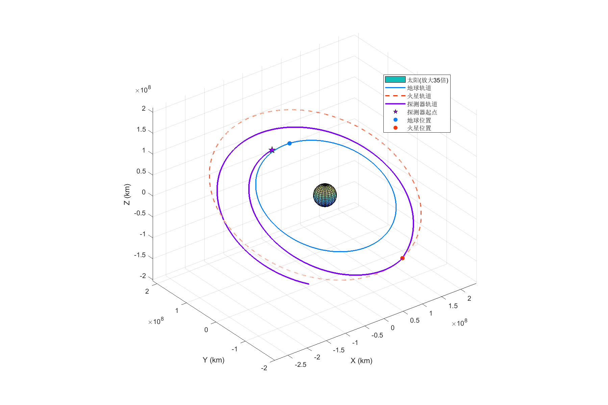

# Keplerian-Motion
行星际飞行轨道递推计算与分析

### Kepler 轨道递推
实现了基于 Kepler 方程的轨道递推计算，通过牛顿迭代法求解，引入选择判断机制优化步长设计，平衡了计算效率与精度。

### 双曲线 Kepler 轨道递推
针对火星引力辅助变轨，分析了探测器在火星引力作用下的轨道特性。

### 数值积分轨道递推
采用四阶 Runge-Kutta 方法实现轨道递推，对比 Kepler 方法，验证了不同方法的精度。

### 火星引力偏转效果分析
利用双曲线轨道kepler递推得到借力偏转轨道，分析在借力飞行期间的近地点半径，以及能量、角动量、速度的变化。

### 轨道图绘制
绘制了日心坐标系下探测器、火星和地球的飞行轨道图，直观展示了探测器的运动轨迹及其与行星的相对位置关系。

## 实验结果

- **精度比较**：Kepler 方法和数值积分方法在精度上表现一致，位置偏差极小，速度偏差几乎为零。
- **火星引力辅助变轨**：探测器在火星引力作用下发生了显著的轨道偏转，速度和角动量均发生了显著变化，轨道能量增加。
- **长期轨道预测**：成功预测了探测器飞出火星引力影响球后的轨道状态，为长期轨道预测提供了参考。
